# aMule Web Controller

A modern, real-time web interface for controlling aMule via the EC (External Connection) protocol. Built with Node.js, WebSockets, and React.

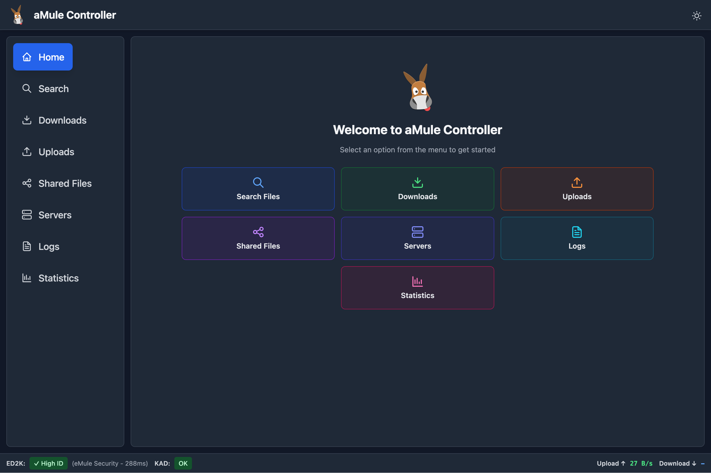

## Features

- 🔍 **Real-time Search** - Search the ED2K/Kad network with live results
- 📥 **Download Management** - Monitor and control active downloads with pause/resume support
- 📂 **Category Management** - Organize downloads into categories with color coding
- 📊 **Detailed Download Info** - Visual segments bar showing file parts availability and detailed source counts
- 📤 **Upload Monitoring** - Track active uploads and queue
- 📁 **Shared Files** - View shared files
- 📈 **Historical Statistics** - Track speed rates and data transferred with interactive charts (24h/7d/30d)
- 🌍 **GeoIP Integration** - View geographic location of peers (optional MaxMind GeoLite2 databases)
- 🔗 **Sonarr/Radarr Integration** - Works as Torznab indexer and qBittorrent-compatible download client
- 🔄 **Automatic Library Scanning** - Trigger Sonarr/Radarr searches at configurable intervals
- 📋 **Logs** - Server info and application logs viewer
- ⚙️ **Configuration Wizard** - Easy first-time setup with guided configuration
- 🎨 **Settings Management** - Configure all settings through the web interface
- 🌓 **Dark Mode** - Automatic theme switching
- 📱 **Responsive Design** - Works on desktop, tablet, and mobile
- ⚡ **WebSocket Updates** - Real-time updates without polling
- 💾 **Persistent Preferences** - Sorting preferences saved across sessions

---

## 🚀 Installation

### 🐳 Docker Quick Start (Recommended)

**Prerequisites:** You should have aMule already installed and running with External Connections (EC) enabled.

#### Option 1: Pre-built Image from Docker Hub

1. **Pull the image**
```bash
docker pull g0t3nks/amule-web-controller:latest
```

2. **Create required directories**

Create the data and logs directories with proper permissions:

```bash
mkdir -p data logs
sudo chown -R 1000:1000 data logs
```

**Note:** The container runs as user `1000:1000`. If your user ID is different, adjust the ownership accordingly or run without `sudo` if you're already user 1000.

3. **Create a `docker-compose.yml` file**

This example assumes **aMule is running on your host machine**:

```yaml
services:
  amule-web:
    image: g0t3nks/amule-web-controller:latest
    user: "1000:1000"
    container_name: amule-web-controller
    ports:
      - "4000:4000"
    environment:
      - NODE_ENV=production
      - PORT=4000
    extra_hosts:
      - "host.docker.internal:host-gateway"  # Required to connect to aMule on host
    volumes:
      - ./logs:/usr/src/app/server/logs
      - ./data:/usr/src/app/server/data
    restart: unless-stopped
```

4. **Start the container**
```bash
docker compose up -d
```

5. **Access the web interface and complete setup**
- Open your browser and navigate to `http://localhost:4000`
- Follow the **interactive setup wizard**:
  - **aMule Host:** Use `host.docker.internal` (to connect to aMule on your host machine)
  - **aMule Port:** `4712` (default EC port)
  - **aMule Password:** Your EC password
  - **Directories:** Keep defaults or customize
  - **Optional Integrations:** Sonarr/Radarr, GeoIP
- All settings are saved to `server/data/config.json`

**Note:** The `extra_hosts` section in docker-compose.yml is required to allow the container to connect to services running on your host machine via the special hostname `host.docker.internal`.

**Optional: All-in-One Setup (with aMule Container)**

If you don't have aMule installed and want to run everything in Docker, use `docker-compose.all-in-one.yml`:

```bash
# Download the all-in-one compose file
curl -O https://raw.githubusercontent.com/got3nks/amule-web-controller/main/docker-compose.all-in-one.yml

# Create the data and logs directories with proper permissions:
mkdir -p data logs
sudo chown -R 1000:1000 data logs

# Start both aMule and the web controller
docker compose -f docker-compose.all-in-one.yml up -d
```

See [docker-compose.all-in-one.yml](docker-compose.all-in-one.yml) in the repository for the full configuration.

**Optional: GeoIP Support**

To enable peer location display, add the GeoIP updater service to your `docker-compose.yml`:

```yaml
  # Add this service to your docker-compose.yml
  geoip:
    image: crazymax/geoip-updater:latest
    container_name: geoip-updater
    environment:
      - GEOIPUPDATE_ACCOUNT_ID=YOUR_ACCOUNT_ID
      - GEOIPUPDATE_LICENSE_KEY=YOUR_LICENSE_KEY
      - GEOIPUPDATE_EDITION_IDS=GeoLite2-City,GeoLite2-Country
      - GEOIPUPDATE_FREQUENCY=24h
    volumes:
      - ./data/geoip:/data
    restart: unless-stopped
```

Get your free MaxMind license at https://www.maxmind.com/en/geolite-free-ip-geolocation-data

Then configure the GeoIP directory path in the Settings page to `server/data/geoip`.

#### Option 2: Build from Source

1. **Clone the repository**
```bash
git clone https://github.com/got3nks/amule-web-controller.git
cd amule-web-controller
```

2. **Start the container**

**Default:** For aMule running on your host machine
```bash
docker compose up -d
```

**Alternative:** All-in-one with aMule container included
```bash
docker compose -f docker-compose.all-in-one.yml up -d
```

3. **Access the web interface and complete setup**
- Open your browser and navigate to `http://localhost:4000`
- Follow the **interactive setup wizard**:
  - **aMule Host:** Use `host.docker.internal` (for host aMule) or `amule` (for container aMule)
  - Configure other settings as needed
- Configuration is saved to `server/data/config.json`

---

### 📦 Native Installation

1. **Clone the repository**
```bash
git clone https://github.com/got3nks/amule-web-controller.git
cd amule-web-controller
```

2. **Install server dependencies**
```bash
cd server
npm install
```

This automatically installs the [amule-ec-node](https://github.com/got3nks/amule-ec-node) library from GitHub.

3. **Build frontend assets**
```bash
cd ..
npm install
npm run build:css
```

4. **Start the server**
```bash
node server/server.js
```

The server will start on **port 4000** by default.

5. **Access the web interface and complete setup**
- Open your browser and navigate to `http://localhost:4000`
- Follow the **interactive setup wizard** to configure:
  - aMule connection (host, port, password)
  - Directory paths
  - Optional integrations (Sonarr/Radarr, GeoIP)
- All settings are saved to `server/data/config.json`

**Optional:** If you prefer to use environment variables instead of the wizard:
```bash
export PORT=4000
export AMULE_HOST=127.0.0.1
export AMULE_PORT=4712
export AMULE_PASSWORD=your_ec_password
export SKIP_SETUP_WIZARD=true  # Skip the wizard

node server/server.js
```

See the [Environment Variables Reference](#environment-variables-reference) for all available options.

---

## ⚙️ Configuration

### First-Time Setup Wizard

When you first access the web interface (or if no configuration exists), you'll be greeted with an interactive setup wizard that guides you through the initial configuration:

1. **Welcome** - Introduction to the setup process
2. **aMule Connection** - Configure host, port, and EC password (with connection testing)
3. **Directories** - Set data, logs, and GeoIP directories
4. **Integrations** - Optionally enable Sonarr and Radarr integration
5. **Review & Save** - Test all settings and save configuration

The wizard will:
- Auto-populate fields with environment variable values or sensible defaults
- Allow you to test each configuration section before proceeding
- Show Docker-specific warnings when running in a container
- Save configuration to `server/data/config.json` for persistence

**Note:** If you're running in Docker, the setup wizard will warn you that changing directory paths requires updating your `docker-compose.yml` volume mounts.

### Settings Page

After initial setup, you can access the Settings page anytime via the settings icon in the top-right corner of the interface. The Settings page allows you to:

- View and edit all configuration options
- Test individual configuration sections (aMule, Directories, Sonarr, Radarr)
- Test all configuration at once before saving
- See which values come from environment variables (marked with a lock icon)
- Enable/disable Sonarr and Radarr integrations with toggle switches

**Important:**
- Your saved configuration always takes precedence - changes take effect immediately
- Some changes (like PORT) may require a server restart to take effect
- Passwords are masked in the UI for security
- Environment variables are used as defaults when config values are not set

### Configuration Precedence

The application uses the following configuration precedence (highest to lowest):

1. **Configuration File** - `server/data/config.json` (created by setup wizard or settings page) - **Highest priority**
2. **Environment Variables** - Used as defaults when config file doesn't exist or specific values are not set
3. **Hardcoded Defaults** - Lowest priority fallback values

This means:
- **User-saved configuration always takes effect** - When you save settings via the UI, they will be used immediately
- **Environment variables serve as initial defaults** - When you first run the wizard, it pre-populates fields with env var values
- **Easy configuration updates** - Change settings through the UI without touching environment variables or restarting
- **Clean deployment** - Set env vars in your docker-compose.yml, then use the UI for fine-tuning

**Example workflows:**

**Recommended: Use the Setup Wizard**
1. Start the container with minimal config (just PORT)
2. Access the web interface
3. Complete the interactive setup wizard
4. All settings saved to `config.json`

**Alternative: Pre-populate with Environment Variables**
1. Add environment variables to your `docker-compose.yml` (see reference below)
2. First run: Wizard auto-populates from these env vars
3. Review and save in the wizard
4. Later: Use Settings page (settings icon in top-right) to modify configuration

**Advanced: Skip Wizard Entirely**
1. Set all required environment variables
2. Set `SKIP_SETUP_WIZARD=true`
3. Application uses env vars directly (no wizard shown)

### Using Environment Variables (Optional)

Environment variables are **completely optional**. The setup wizard is the recommended configuration method. However, you can use environment variables to:
- Pre-populate the wizard with your settings
- Skip the wizard for automated deployments
- Provide quick initial values

To use environment variables, add them to your `docker-compose.yml`:

```yaml
services:
  amule-web:
    environment:
      # Basic Configuration
      - PORT=4000
      - NODE_ENV=production

      # aMule Connection (optional - wizard will ask if not set)
      - AMULE_HOST=host.docker.internal
      - AMULE_PORT=4712
      - AMULE_PASSWORD=your_password

      # Sonarr Integration (optional)
      - SONARR_URL=http://sonarr:8989
      - SONARR_API_KEY=your_api_key
      - SONARR_SEARCH_INTERVAL_HOURS=6

      # Radarr Integration (optional)
      - RADARR_URL=http://radarr:7878
      - RADARR_API_KEY=your_api_key
      - RADARR_SEARCH_INTERVAL_HOURS=6

      # Advanced Settings (optional)
      - ED2K_SEARCH_DELAY_MS=10000
      - ED2K_CACHE_TTL_MS=600000

      # Skip wizard (optional - only if all settings provided)
      - SKIP_SETUP_WIZARD=false
```

See the [Environment Variables Reference](#environment-variables-reference) section below for a complete list.

### aMule EC Setup

Before using this web controller, you must enable External Connections in aMule:

1. **Open aMule** (or amuled configuration)
2. **Navigate to Preferences** → **Remote Controls** → **External Connections**
3. **Enable "Accept external connections"**
4. **Set an EC password** (remember this for the web controller configuration)
5. **Note the EC port** (default: 4712)
6. **Optional:** Configure allowed IP addresses for security

### Environment Variables Reference

**Note:** All environment variables are optional. If not provided, the setup wizard will prompt for required values.

| Variable | Default           | Description | Notes |
|----------|-------------------|-------------|-------|
| **Server** |
| `PORT` | `4000`            | Web server listening port | Optional |
| `NODE_ENV` | `production`     | Node environment (`development` or `production`) | Optional |
| **aMule Connection** | | | *Wizard will prompt if not set* |
| `AMULE_HOST` | `127.0.0.1`       | aMule daemon hostname or IP address | Optional |
| `AMULE_PORT` | `4712`            | aMule EC protocol port | Optional |
| `AMULE_PASSWORD` | -           | aMule EC connection password | Optional |
| **Sonarr Integration** | | | *All optional* |
| `SONARR_URL` | -                 | Sonarr base URL (e.g., `http://localhost:8989`) | Optional |
| `SONARR_API_KEY` | -                 | Sonarr API key for authentication | Optional |
| `SONARR_SEARCH_INTERVAL_HOURS` | `0` (disabled)    | Hours between automatic missing episode searches | Optional |
| **Radarr Integration** | | | *All optional* |
| `RADARR_URL` | -                 | Radarr base URL (e.g., `http://localhost:7878`) | Optional |
| `RADARR_API_KEY` | -                 | Radarr API key for authentication | Optional |
| `RADARR_SEARCH_INTERVAL_HOURS` | `0` (disabled)    | Hours between automatic missing movie searches | Optional |
| **Advanced Settings** | | | *All optional* |
| `ED2K_SEARCH_DELAY_MS` | `10000`           | Delay between ED2K searches (prevents flood protection) | Optional |
| `ED2K_CACHE_TTL_MS` | `600000` (10 min) | Search result cache duration (handles pagination) | Optional |
| `SKIP_SETUP_WIZARD` | `false` | Skip the setup wizard (requires all settings configured) | Optional |

### Docker Network Configuration

**Default Setup - aMule on Host Machine:**

This is the most common scenario and the default docker-compose.yml is configured for this:

```yaml
extra_hosts:
  - "host.docker.internal:host-gateway"  # Required!
```

- In the setup wizard, use **`host.docker.internal`** as the aMule Host
- The `extra_hosts` line in docker-compose.yml is **required** - it creates a special hostname that points to your host machine
- Works on Docker Desktop (Mac/Windows) and Linux with recent Docker versions

**Alternative: aMule in Another Container**

If using the all-in-one setup or aMule is in a separate container:
- Use the **service name** as hostname (e.g., `amule`)
- Ensure both containers are on the same Docker network
- The `extra_hosts` line is not needed in this case

**Alternative: Remote aMule**

If aMule is running on a different machine entirely:
- Use the **IP address** or **hostname** of the remote machine
- Ensure aMule EC port (4712) is accessible from your network
- The `extra_hosts` line is not needed in this case

---

## 🌍 GeoIP Integration (Optional)

This application supports **MaxMind GeoLite2 databases** to display geographic locations of peers in the uploads view.

### Setting Up GeoIP

1. **Get a free MaxMind license** at https://www.maxmind.com/en/geolite-free-ip-geolocation-data

2. **Add GeoIP updater to your docker-compose.yml** (see example above)

3. **Configure GeoIP directory in Settings**:
   - Default: `server/data/geoip`
   - The updater will download `GeoLite2-City.mmdb` and `GeoLite2-Country.mmdb` to this directory

4. **Restart the application** to load the databases

The application will automatically use the GeoIP databases if found, showing country flags and city information for upload peers.

---

## 🔗 Sonarr/Radarr Integration

This application provides **full Sonarr and Radarr integration** with two components:

1. **Torznab Indexer API** - Makes ED2K network searchable from Sonarr/Radarr
2. **qBittorrent-Compatible Download Client** - Allows Sonarr/Radarr to manage downloads
3. **Automatic Search Scheduling** - Periodically triggers library scans for missing content

### Torznab Indexer Setup

**For Sonarr:**
1. Add a new Torznab indexer in Sonarr: Settings → Indexers → Add → Torznab → Custom
2. Set the URL: `http://your-server:4000/indexer/amule/api`
3. Leave API key empty (not required)
4. Test and save

**For Radarr:**
1. Add a new Torznab indexer in Radarr: Settings → Indexers → Add → Torznab → Custom
2. Set the URL: `http://your-server:4000/indexer/amule/api`
3. Leave API key empty (not required)
4. Test and save

### qBittorrent Download Client Setup

**For Sonarr:**
1. Add a download client in Sonarr: Settings → Download Clients → Add → qBittorrent
2. Set the Host: `your-server` (or IP address)
3. Set the Port: `4000` (your web controller port)
4. Leave Username and Password empty
5. Test and save

**For Radarr:**
1. Add a download client in Radarr: Settings → Download Clients → Add → qBittorrent
2. Set the Host: `your-server` (or IP address)
3. Set the Port: `4000` (your web controller port)
4. Leave Username and Password empty
5. Test and save

### Automatic Search Scheduling (Optional)

Configure automatic searches via Settings page or environment variables:

**For Sonarr:**
```env
SONARR_URL=http://localhost:8989
SONARR_API_KEY=your_api_key_here
SONARR_SEARCH_INTERVAL_HOURS=6
```

**For Radarr:**
```env
RADARR_URL=http://localhost:7878
RADARR_API_KEY=your_api_key_here
RADARR_SEARCH_INTERVAL_HOURS=6
```

The server will automatically trigger searches for:
- Missing episodes/movies
- Quality upgrades based on your quality profiles

### ED2K Rate Limiting & Caching

To prevent triggering ED2K server flood protection, the indexer implements two protective mechanisms:

1. **Rate Limiting**: Enforces minimum delay between consecutive ED2K searches
   - Default: 10 seconds between searches
   - Configurable via `ED2K_SEARCH_DELAY_MS` environment variable
   - Recommended: 5000-10000ms (5-10 seconds) for busy Sonarr/Radarr instances

2. **Search Result Caching**: Prevents duplicate searches when Sonarr/Radarr uses pagination
   - Sonarr/Radarr makes multiple requests with `offset` parameters (offset=0, offset=100, etc.)
   - Results are cached for 10 minutes by default to serve paginated requests
   - Only the first request (offset=0) triggers an actual ED2K search
   - Subsequent pagination requests are served from cache
   - Configurable via `ED2K_CACHE_TTL_MS` environment variable
   - This dramatically reduces ED2K server load and prevents flood protection bans

---

## Development

### Frontend Development
```bash
# Watch and rebuild CSS on changes
npm run watch:css
```

### Server Development
```bash
# Uses nodemon for auto-restart
npx --prefix ./server/ nodemon server/server.js
```

### Project Structure
```
.
├── server/
│   ├── server.js              # Main server entry point
│   ├── database.js            # SQLite database for historical metrics
│   ├── modules/               # Modular server components
│   │   ├── amuleHandler.js    # aMule EC protocol handler
│   │   ├── metricsAPI.js      # Historical metrics API endpoints
│   │   ├── torznabAPI.js      # Torznab indexer implementation
│   │   ├── qbittorrentAPI.js  # qBittorrent download client compatibility
│   │   ├── geoIPManager.js    # GeoIP database manager
│   │   ├── config.js          # Configuration management
│   │   └── ...
│   ├── lib/                   # Shared libraries
│   ├── package.json           # Server dependencies
│   └── data/                  # SQLite database & config storage
├── static/
│   ├── app.js                 # Main React application
│   ├── components/            # React components
│   │   ├── common/            # Reusable components
│   │   ├── layout/            # Layout components
│   │   ├── modals/            # Modal dialogs
│   │   └── views/             # Page views
│   ├── hooks/                 # Custom React hooks
│   ├── utils/                 # Utility functions
│   ├── index.html             # HTML entry point
│   └── output.css             # Built Tailwind CSS
├── src/
│   └── input.css              # Tailwind source
├── Dockerfile                 # Multi-stage Docker build
├── docker-compose.yml         # All-in-one setup
├── docker-compose.standalone.yml  # Standalone web controller
└── package.json               # Frontend build dependencies
```

## Dependencies

### Backend
- **[express](https://expressjs.com/)** - Web framework
- **[ws](https://github.com/websockets/ws)** - WebSocket server
- **[amule-ec-node](https://github.com/got3nks/amule-ec-node)** - aMule EC protocol implementation
- **[better-sqlite3](https://github.com/WiseLibs/better-sqlite3)** - SQLite database for historical metrics
- **[maxmind](https://www.npmjs.com/package/maxmind)** - GeoIP database reader (optional)

### Frontend
- **React 18** - UI framework (loaded via CDN)
- **Chart.js** - Interactive charts for historical data (loaded via CDN)
- **Tailwind CSS** - Utility-first CSS framework

## API / WebSocket Protocol

### REST API Endpoints

The server provides REST endpoints for historical metrics data:

#### GET `/api/metrics/speed-history?range={24h|7d|30d}`
Returns speed data with different granularities:
- **24h**: 15-second buckets (~5,760 points)
- **7d**: 15-minute buckets (672 points)
- **30d**: 1-hour buckets (720 points)

Response:
```json
{
  "range": "24h",
  "data": [
    {
      "timestamp": 1234567890000,
      "uploadSpeed": 102400,
      "downloadSpeed": 512000
    }
  ]
}
```

#### GET `/api/metrics/history?range={24h|7d|30d}`
Returns data transferred with time buckets:
- **24h**: 15-minute buckets (96 bars)
- **7d**: 2-hour buckets (84 bars)
- **30d**: 6-hour buckets (120 bars)

Response:
```json
{
  "range": "24h",
  "data": [
    {
      "timestamp": 1234567890000,
      "uploadSpeed": 102400,
      "downloadSpeed": 512000,
      "uploadedDelta": 1024000,
      "downloadedDelta": 5120000
    }
  ]
}
```

#### GET `/api/metrics/stats?range={24h|7d|30d}`
Returns summary statistics for the time range:

Response:
```json
{
  "range": "24h",
  "totalUploaded": 10737418240,
  "totalDownloaded": 53687091200,
  "avgUploadSpeed": 124108,
  "avgDownloadSpeed": 620540,
  "peakUploadSpeed": 1048576,
  "peakDownloadSpeed": 5242880
}
```

### Torznab API Endpoints

#### GET `/indexer/amule/api?t=caps`
Returns Torznab capabilities

#### GET `/indexer/amule/api?t=search&q={query}`
Performs ED2K search and returns results in Torznab format

### qBittorrent API Endpoints

Compatible with qBittorrent Web API v2:

- `GET /api/v2/app/version` - Returns version
- `GET /api/v2/torrents/info` - Lists downloads
- `POST /api/v2/torrents/add` - Adds download from ED2K link
- `POST /api/v2/torrents/pause` - Pauses download
- `POST /api/v2/torrents/resume` - Resumes download
- `POST /api/v2/torrents/delete` - Deletes download

### WebSocket Protocol

The server exposes a WebSocket endpoint for real-time communication:

### Client → Server Actions
```javascript
// Search
{ action: 'search', query: 'file name', type: 'global' }

// Get downloads
{ action: 'getDownloads' }

// Get uploads
{ action: 'getUploadingQueue' }

// Get shared files
{ action: 'getShared' }

// Get statistics
{ action: 'getStats' }
{ action: 'getStatsTree' }

// Get logs
{ action: 'getLog' }
{ action: 'getServerInfo' }

// Download file
{ action: 'download', fileHash: '...' }

// Pause/Resume
{ action: 'pauseDownload', fileHash: '...' }
{ action: 'resumeDownload', fileHash: '...' }

// Delete file
{ action: 'delete', fileHash: '...' }

// Category management
{ action: 'getCategories' }
{ action: 'createCategory', category: {...} }
{ action: 'updateCategory', id: 1, category: {...} }
{ action: 'deleteCategory', id: 1 }
{ action: 'setFileCategory', fileHash: '...', categoryId: 1 }
```

### Server → Client Messages
```javascript
// Search results
{ type: 'search-results', data: [...] }

// Downloads update
{ type: 'downloads-update', data: [...] }

// Stats update
{ type: 'stats-update', data: {...} }

// Categories update
{ type: 'categories-update', data: [...] }

// And more...
```

---

## Screenshots


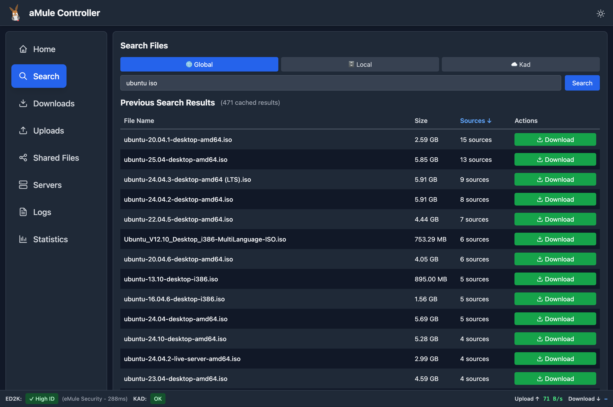
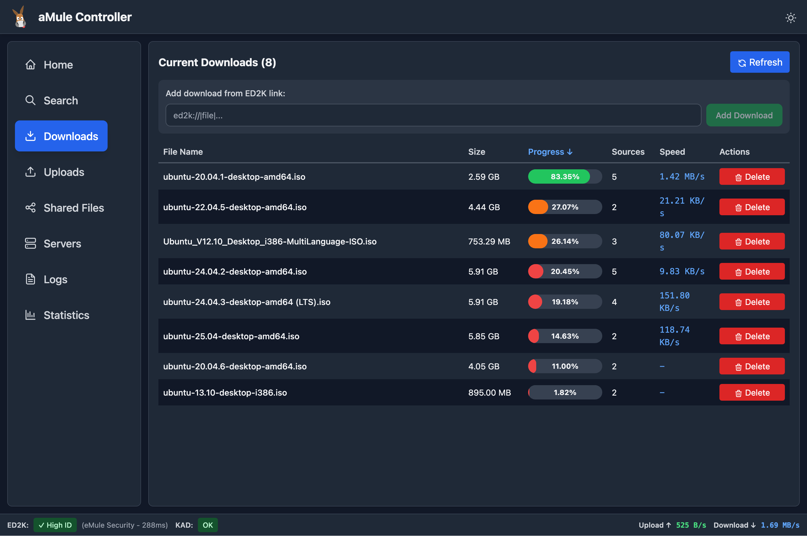
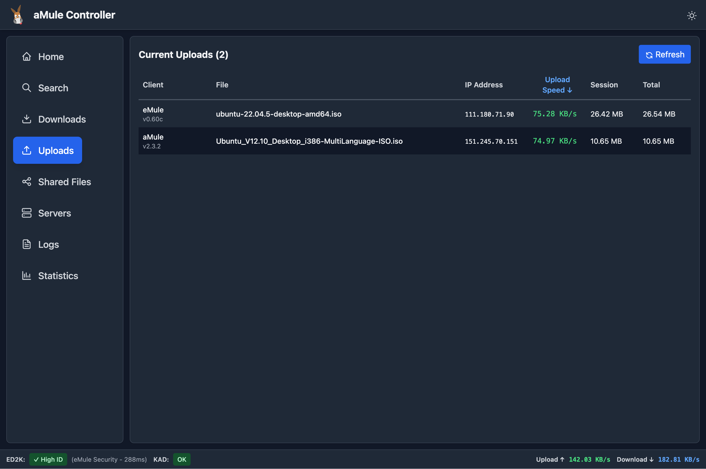
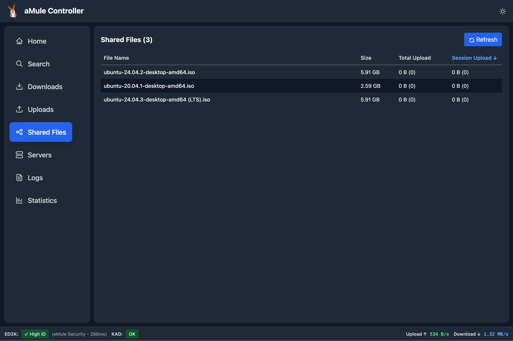
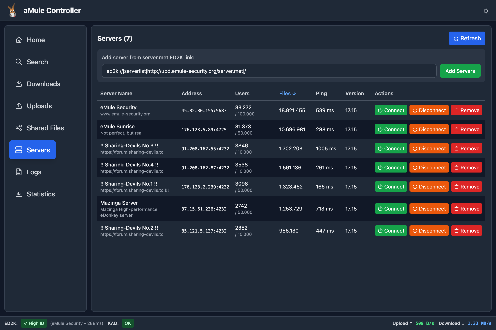
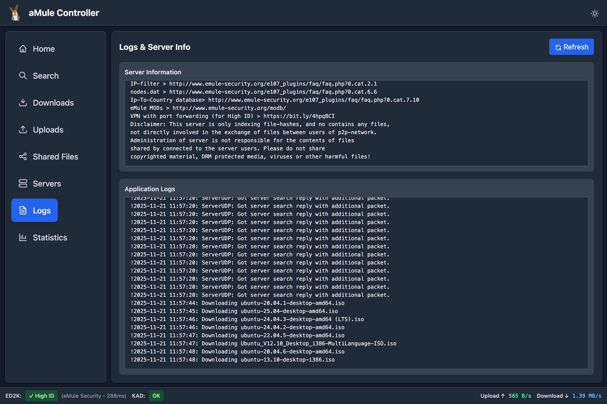
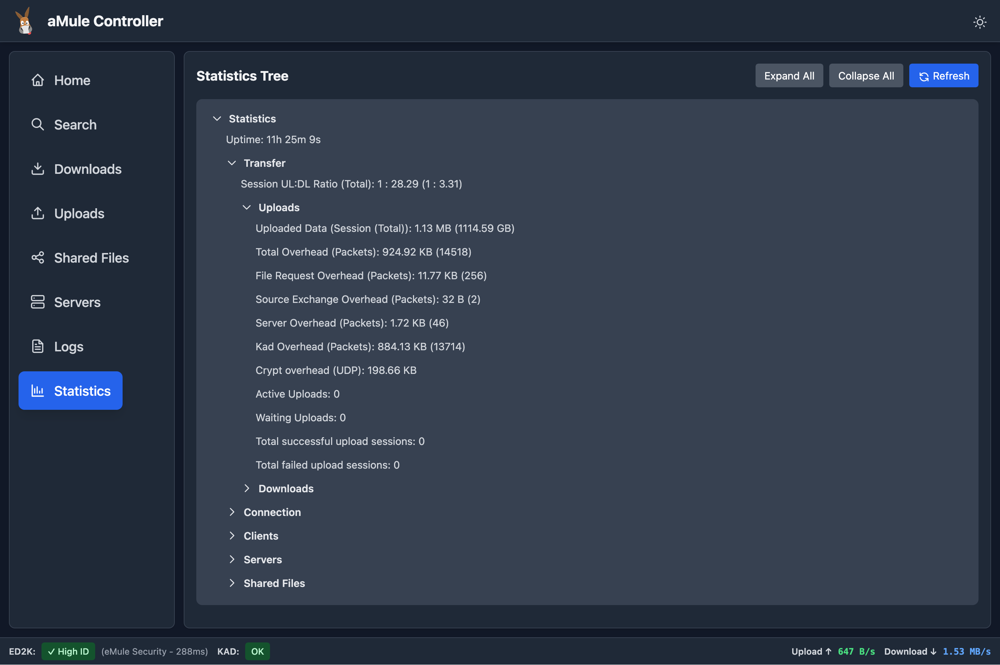

## Screenshots (Mobile)

<div style="display: flex; gap: 10px;">
  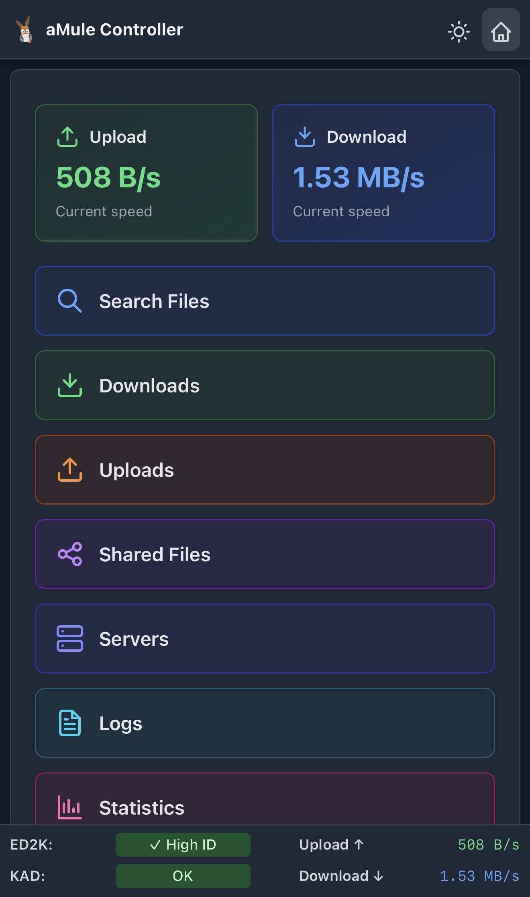
  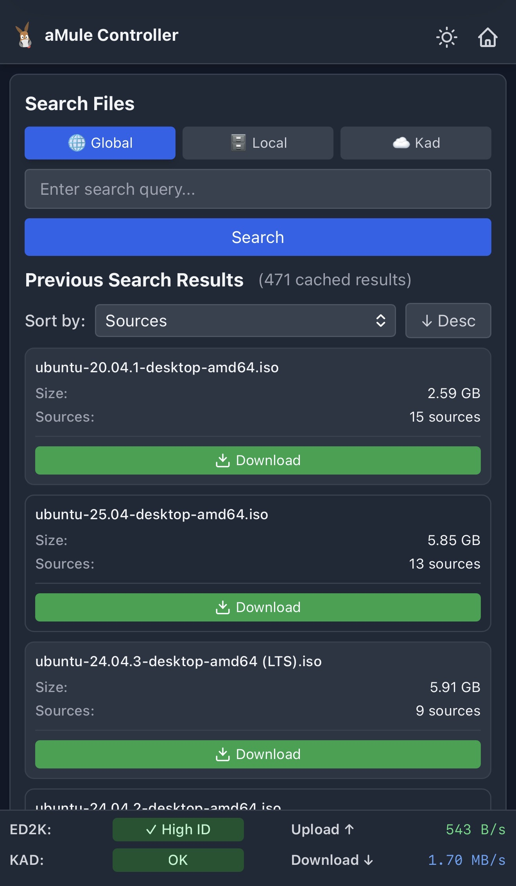
  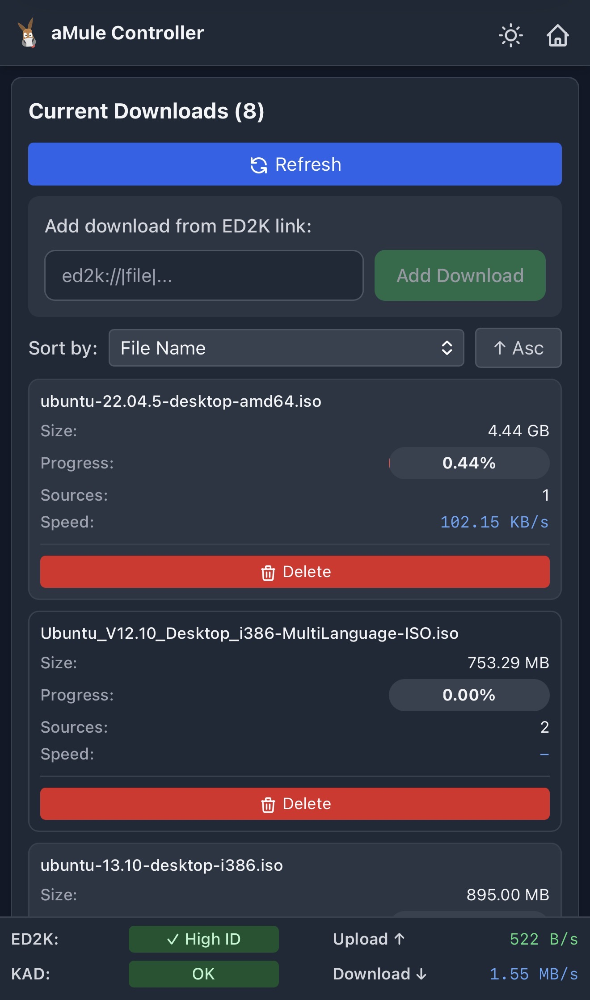
  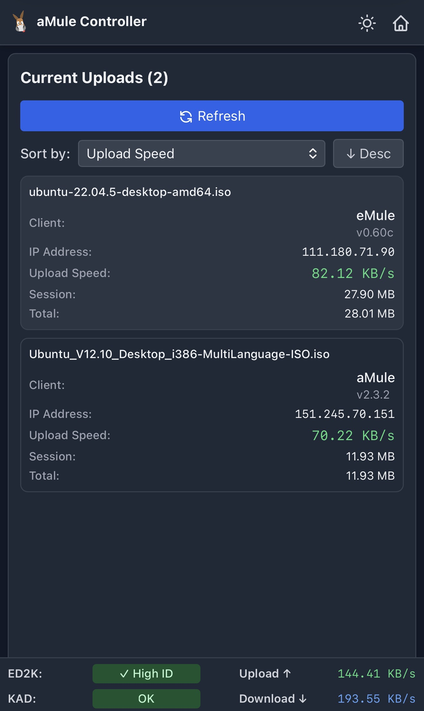
  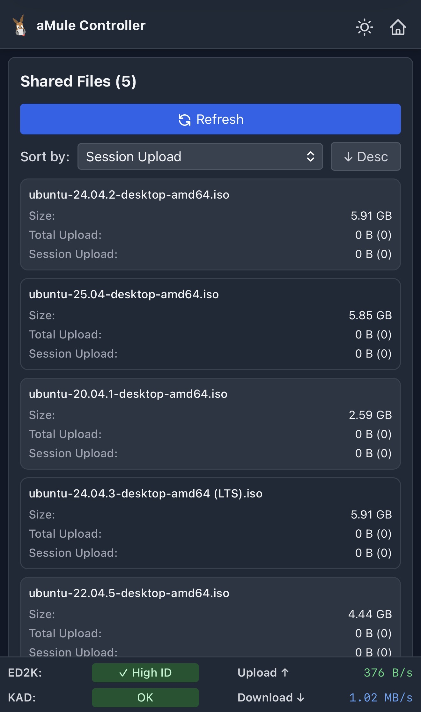
  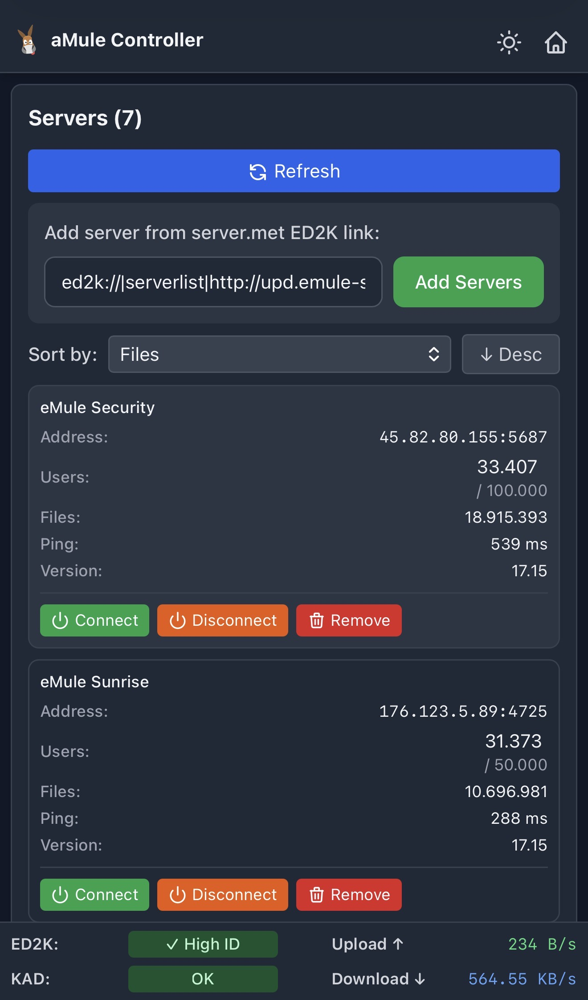
  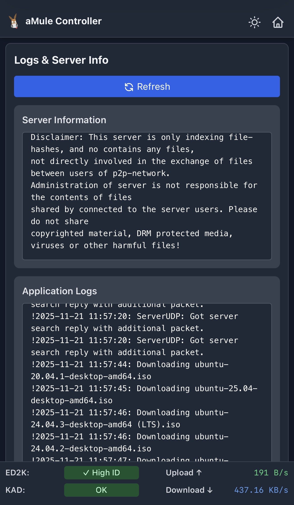
  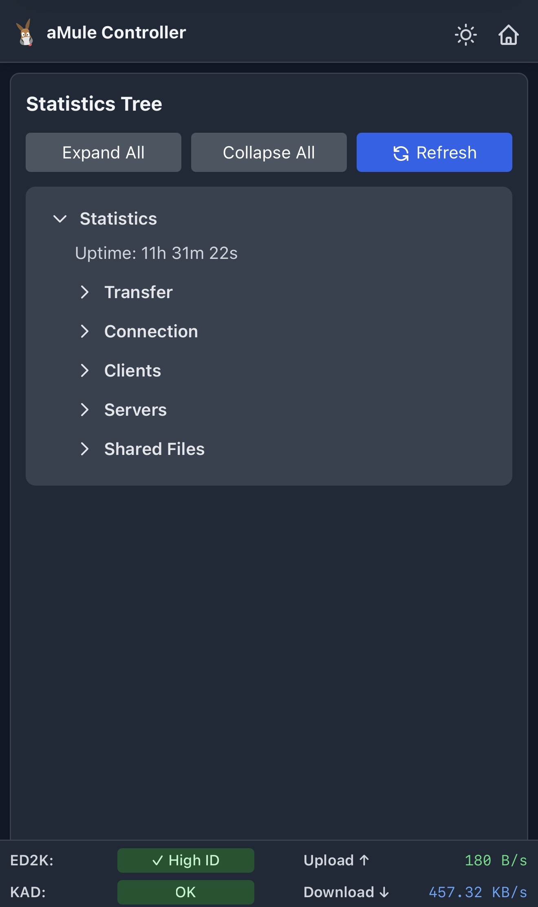
</div>

---

## Troubleshooting

### Git not found during npm install
If you see `npm error syscall spawn git` or `ENOENT git`, you need to install git:

**Ubuntu/Debian:**
```bash
sudo apt-get install git
```

**macOS:**
```bash
brew install git
```

**Windows:**
Download from https://git-scm.com/download/win

Then retry: `npm install`

### Can't connect to aMule
- Verify aMule EC is enabled and running
- Check the EC password is correct
- Ensure firewall allows connection to EC port
- Check aMule logs for connection attempts

### WebSocket disconnects frequently
- Check network stability
- Verify aMule daemon is running
- Check server logs in `logs/server.log`

### Frontend not loading
- Ensure CSS was built: `npm run build:css`
- Check browser console for errors
- Verify static files are served correctly

### GeoIP not working
- Verify databases are downloaded to the correct directory
- Check file permissions on database files
- Ensure databases are named `GeoLite2-City.mmdb` and `GeoLite2-Country.mmdb`

### Sonarr/Radarr integration issues
- Verify API keys are correct
- Check network connectivity between services
- Review server logs for error messages
- Ensure ED2K rate limiting is configured appropriately

---

## License

This project is licensed under the MIT License - see the [LICENSE](LICENSE) file for details.
